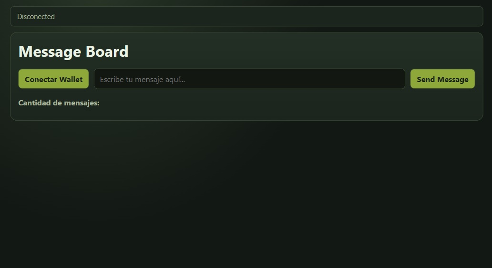
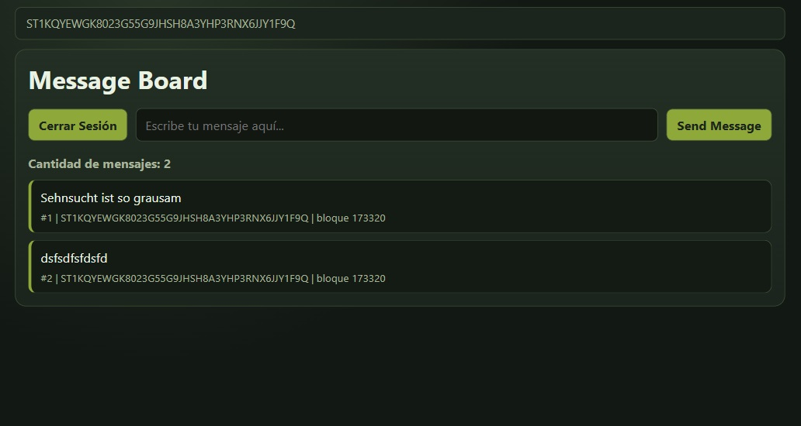

# Message Board on Stacks

A decentralized message board built on the Stacks blockchain. Users connect their wallet, pay 1 satoshi of sBTC, and post a message stored on-chain permanently.




## Features

- Connect/disconnect Stacks wallet
- Post messages on-chain (costs 1 sat sBTC)
- Read all messages with author and Bitcoin block height
- Post conditions enforce exact sBTC payment

## Tech Stack

- **Smart Contract:** Clarity (Stacks blockchain)
- **Frontend:** Vanilla JavaScript, HTML, CSS
- **Libraries:** `@stacks/connect`, `@stacks/transactions`, `@stacks/network`
- **Token:** sBTC (testnet)

## Contract

| Item     | Value                                                  |
| -------- | ------------------------------------------------------ |
| Network  | Stacks Testnet                                         |
| Contract | `message-board-v2`                                     |
| sBTC     | `SM3VDXK3WZZSA84XXFKAFAF15NNZX32CTSG82JFQ4.sbtc-token` |

## How It Works

1. User connects wallet via Stacks Connect
2. Calls `add-message` — transfers 1 sat sBTC to the contract
3. Message is stored in a on-chain map with author and `burn-block-height`
4. Frontend reads messages via `get-message` (read-only, no fee)

## Run Locally

```bash
git clone <repo-url>
cd <project-folder>
# Open index.html in your browser or use a local server
npx serve .
```

> Requires a Stacks wallet (Leather or Xverse) connected to **testnet**.

## Author

**Gustavo Nicolás Castellón**  
[GitHub](https://github.com/ichbinzeed) · [LinkedIn](https://www.linkedin.com/in/ichbinzeed)
